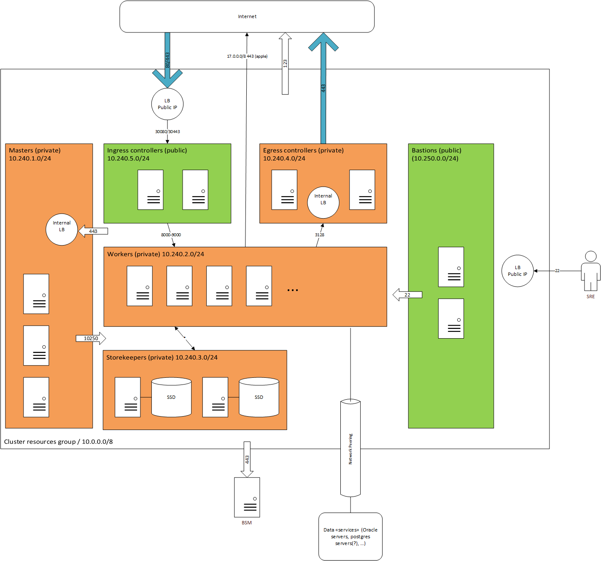

# MDS Cluster Provisioning with Terraform

Doc generated with https://stackedit.io/app

## Description
This project contains the terraform scripts to deploy a kubernetes cluster over Azure.
The cluster is composed by 5 blocks:

 - **Masters block** : Subnet and VMs storing the etcd and the core pods of kubernetes. The api server is accessed by an internal load balancer.
 - **Workers block** : Subnet and VMs used to process the applications pods.
 - **Ingress block** : Subnet and VMs osting the ingress controllers (nginx). It is the single entry point for the hosted services.
 - **Proxies block**: Subnet and VMs hosting forward proxies to control the outbound connections to internet It is the only subnet accessing internet.
 - **Bastion block**: Subnet and VMs hosting SSH bastion services.

## System design

# How to run
## Configuration

A configuration file is to be created for rach provisioned cluster :

    cloud_provider          = "azure"
    az_subscription_id      = "[subscription id where to deply the assets]"
    az_client_id            = "[aad client id dedicated to terraform]"
    az_client_secret        = "[aad secret related to prevous client id]"
    az_tenant_id            = "[tenant id to use]"

    cluster_name            = "[name of the cluster, will create a resource group with the same name]"
    location                = "[localisation of the resource group and created resources]"

    # Connection to registry
    registry_credentials    = "[docker credentials (in the form of a dockercfg) ]"

    #
    coreos_version          = "[coreos version, default is latest]"

    # Size of the blocks
    worker_count            = 1 # Number of workers to provision
    worker_size             = "Standard_D2s_v3" [azure size f the worker vm]
    worker_disk_type        = "Premium_LRS" [ type of the managed disks ]

    #
    environment           = "dev"
    version               = "module"

## Launch the provisioning
To provision, launch the command : 

    docker run --rm -t -v [path to your config file]:/config docker.bsm.utility.valapp.com/terraform/kubernetes_azure:[version] [plan|apply|refresh]

## State files

The state files are stored remotely on `bsm/terraform-states` with the name of the cluster. 

# How to build

The terraform is packaged as a docker image. To build an image, run the following (note the `dev-` prefix):
    docker build . -t dev-docker.bsm.utility.valapp.com/terraform/kubernetes_azure:[version]
Try to launch the docker conatiner with the run instrcution (see previous chapter). 
 

    docker run --rm -t -v [path to your config file]:/config dev-docker.bsm.utility.valapp.com/terraform/kubernetes_azure:[version] [plan|apply|refresh]

Once ok, push the image to BSM : 

    docker push dev-docker.bsm.utility.valapp.com/terraform/kubernetes_azure:[version]

# How to develop
Check the following guides :

## Azure specific documentation
 - [Infra base, ie resource group, vnet and cloud provider config file](docs/base_azure_module.md)
 - [Firewalls](docs/nsg.md)
 - [Load balancers](docs/lb.md)
 - [Network and routing configuration for Azure and Kubernetes](docs/networking.md)
 - [Blocks](docs/block_definition.md)

Check also the [terraform doc for Azure provider](https://www.terraform.io/docs/providers/azurerm/index.html)

## Ignition modules
Contains the elements to provision the OS : 
 - [Kubectl install](docs/ignition/kubectl.md)

