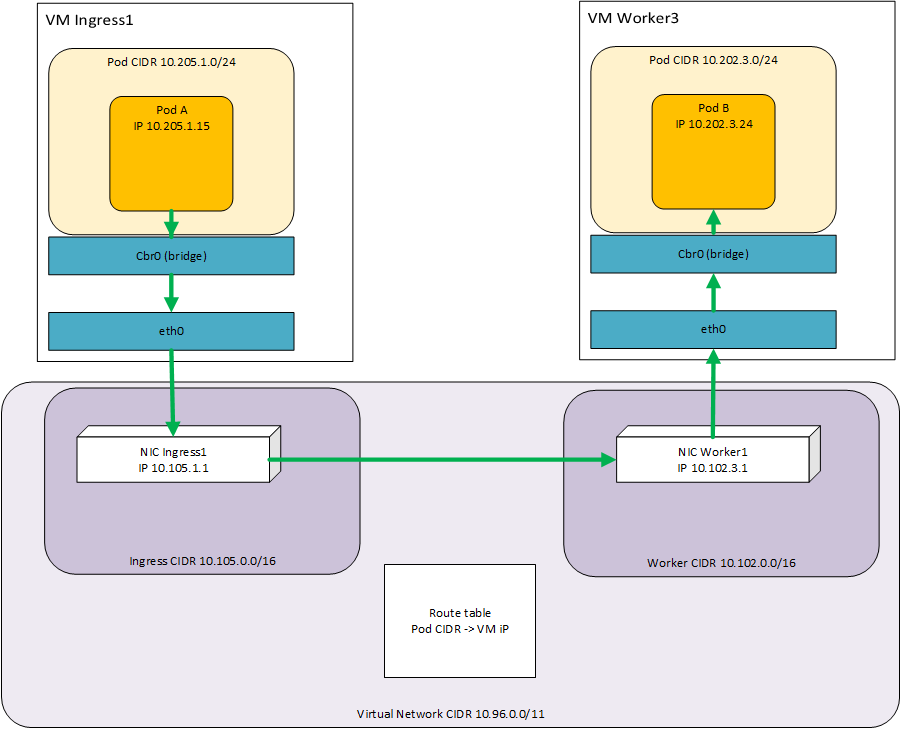

# Networking

In this cluster, many networking parts are "manually" managed instead of using the automated configuration from kubernetes (kube-controiller-manager) 
The main idea is to predetermine the CIDR of VMs and Pods CIDR in the machines so as to create firewall rules.

## How it works

Let's consider a pod A on ingress1 machine communicating with a pod B on worker3. 



 1. The pod A sends its request to pod B IP
 2. The bridge cbr0 transfers it to the eth0
 3. the route table gives the hop point associated with the trageted pod B IP
 4. The NIC transfers it to the worker3 NIC
 5. Once in the VM, the requests is transfered to the bridge and is routes to the right POD 

## CIDRs

The CIDRs are defined in the file cluster_constants.tf

**Important Note : the VM IP range and the Pods IP range MUST NOT overlap. If so, the routing cannot work between the hosts.**


## Network Interface Cards

### Principle

A node/VM communicates on a network/subnet though a Network Interface Card (NIC). This NIC is associated with an IP. 
The current network CIDR is `10.0.0.0/8`. One subnet is created with a range of `10.96.0.0/11`.
From this range are determined the CIDRs for each block : for instance, masters NIC are associated with CIDR `10.101.0.0/16`, workers with `10.102.0.0/16`. 
The module `azure/block` [`vm.tf`](../cluster/modules/azure/block/vm.tf) will generate a static private IP  and associate it with the right CIDR. 
The machine number is set on the third byte. 
For instance, the first master has the IP `10.101.1.1`, the second `10.101.2.1`, etc...
The reason is to easily associate an IP with a pod CIDR in `/24`. It will be explained in the next chapter. 
### Code
The code for this 

```terraform
resource "azurerm_network_interface" "nic-without-loadbalancer" {

    name                        = "${var.name}${count.index + 1}-nic"
    count                      = "${ var.type == "none" ? var.count : 0 }"

    location                    = "${var.location}"
    resource_group_name         = "${var.resourcegroup}"

    enable_ip_forwarding        = true
    network_security_group_id   = "${azurerm_network_security_group.nsg.id}"

    ip_configuration {
        name                    = "${var.name}${count.index + 1}-ip"
        subnet_id               = "${var.subnet_id}"
        private_ip_address_allocation = "static"
        private_ip_address = "${ cidrhost( cidrsubnet(var.cidr, 8, count.index + 1), 1)}"
    }
}
```

Three main lines have to be considered here :
 
    private_ip_address_allocation = "static"

Here is indicated that the IP is predetermined, ie the IP is not defined by a DHCP once the NIC is connected to it.

    cidrhost( cidrsubnet(var.cidr, 8, count.index + 1), 1)
    
The `cidrsubnet` function allows to extend a range to create a subnet range.
The above `cidrsubnet` will extend the `/16` range to a `/16+8` range, ie, `/24`.
The last parameter will determine the number of the network.

For instance, the master CIDR is `10.101.0.0/16`. For the first master `(count.index = 0)`, it will generate the subnet `10.101.1.0/24` CIDR. For the second master, the CIDR `10.101.2.0/24`, etc...

The `cidrhost` will generate an IP for the CIDR. As we have already incremented the third byte, n o need to increment the number, that's why it is set to `1`. 

So for the first master, the IP will be the number `1` of CIDR `10.101.1.0/24`, ie `10.101.1.1`. The second is the number `1` of `10.101.2.0/24`, ie `10.101.2.1`, etc...

    enable_ip_forwarding        = true

:warning: *Extremely important for kubernetes!*   
This allows the IP routing from the POD network through the Azure network. It allows to foward the pod ip that will be interpreted by the route table to be redirected to the VM hosting the targeted pod.  

## Kubernetes Controller Manager

The controller manager is the core component from the cluster preparing the networking assets (like the routes, load balancers, etc...) and assigning the pod cidr. In the current cluster, the routes and CIDR are provisionned by terraform, therefore, this feature by default has to be unset. 

This is handled by the module `modules/ignition/manifests`, more specifically the template [`modules/ignition/manifests/resources/kube-controller-manager.yaml`](../cluster/modules/ignition/manifests/resources/kube-controller-manager.yaml).

The two options to consider are: 

 - `- --allocate-node-cidrs=false` : this option prevents controller manager to determine by itself a pod CIDR. Terraform does it (cf below)
 - `- --configure-cloud-routes=false` : this option prevents controller manager from provisionning the routes on azure route table as we proivision them by terraform (cf below)

## Kubelet service

The kubelet runs as a service on machines. It is the component creating the bridge interface and creating the sub net for the hosted pods. 
The pod cidr is usually provided by the controller manager. As we prevent the controller manager to provide CIDR, we have to pass it to the kubelet service. 

The module handling that is modules/ignition/kubelet and more specifically the template resources/kubelet.service

The important options are: 

 - `--network-plugin=kubenet` : this network plugin creates the bridge network interface cbr0 and the related Kernel IP routing
 - `--hairpin-mode=promiscuous-bridge` : this defines the mode of the pod interface to create. By default, it is promiscuous-bridge, but to be clearer about the config, we have set it explicitely. 
 - `--pod-cidr=$${pod_cidr}` : this option allows to explicitly set the CIDR for this bridge. 
 
 Please note that the double dollar. The idea here is not to generate an ignition file, but a template of an ignition file. After the first rendering, the value of `$${pod_cidr}` will be `${pod_cidr}`. 

This template is then passed to the block provisionning NICs, VMs, etc... ie in the module modules/azure/block (more specifically [`vm.tf`](../cluster/modules/azure/block/vm.tf))

This previous ignition template is interpolated again with the value `"${cidrsubnet(var.pod_cidr, 8, count.index + 1)}"`. It generates a subnet dedicated to the machine : in the same principle as the azure network principle, for each block, we have define a `/16` range. 
For instance, for masters, we have defined `10.101.0.0/16` CIDR for vms, and `10.201.0.0/16` CIDR for pods.

So as to easily associate a CIDR with a VM, we generate a `/24` subnet from `cidrsubnet` function (so extending by 8 bits). 
For our masters, `master1` will generate a CIDR `10.201.1.0/24`, `master2` will generate a CIDR `10.201.2.0/24`, etc...

This calculated CIDR is then passed as input to the ignition template which sets the kubelet service

For instance, `master1` will have a kubelet.service set with the option `--pod-cidr=10.201.1.0/24`, `master2` with  `--pod-cidr=10.201.2.0/24`, etc...

## Route Table

Each node hosts its own subnet (pod CIDR). The routes allow to interpolate the pods networking into the azure network. In our intial schema, to route the request from the pod A to the pod B, we have to route the requests from ingress1 machine to worker3 machine. The route precisely defines this. 

The route is defines in `modules/azure/block` and more precisely in [`vm.tf`](../cluster/modules/azure/block/vm.tf):

```
resource "azurerm_route" "route" {
        count                   = "${var.count}"

        name                    = "${azurerm_virtual_machine.vm.*.name[count.index]}"
        resource_group_name     = "${var.resourcegroup}"
        route_table_name        = "${var.routetable}"
        address_prefix          = "${cidrsubnet(var.pod_cidr, 8, count.index + 1)}"
        next_hop_type           = "VirtualAppliance"
        next_hop_in_ip_address  = "${ cidrhost( cidrsubnet(var.cidr, 8, count.index + 1), 1)}"
}
```

 - `route_table_name       = "${var.routetable}"` : this is the name of the route provisionned in azure. It is provisionned by module `modules/azure/base` and associated with the subnet. 
 - `address_prefix         = "${cidrsubnet(var.pod_cidr, 8, count.index + 1)}"` : This is the CIDR that will be routed. Here, we route the same CIDR as the one we pass to kubelet. 
 - `next_hop_type          = "VirtualAppliance"` : the hop type defines here that it will be a virtual machine that will handle the next routing (handled by the bridge cbr0)
 - `next_hop_in_ip_address = "${ cidrhost( cidrsubnet(var.cidr, 8, count.index + 1), 1)}"` : This is the IP of the VM hosting the pod CIDR.

For instance, we will define the following routes :

| Name | Pods | VM |
|---|---|---|
| master1 | 10.201.1.0/24 | 10.101.1.1 |
| master2 | 10.201.2.0/24 | 10.101.2.1 |
| worker1 | 10.202.1.0/24 | 10.101.1.1 |
| worker3 | 10.202.3.0/24 | 10.101.3.1 |
